# 

**Interactive multi-track visualization of genomic statistics on rectangular chromosomes**

RectChr combines an interactive graphical user interface (GUI) with a command-line interface (CLI) for chromosome-scale visualization. Arrange chromosomes horizontally or vertically, combine multiple data tracks, and customize each track to explore genomic patterns or prepare figures.

The GUI supports interactive exploration and parameter adjustment, while the CLI supports batch plotting and reproducible analysis workflows.


[Quick start](#quick-start) · [Interactive GUI](#interactive-gui) · [Configuration](#configuration) · [Examples](#examples) · [Documentation](#documentation) · [Support](#support)

## Features

- **Interactive exploration:** configure parameters visually, switch plot types, and inspect SVG previews with manual or automatic refresh.
- **GUI and CLI workflows:** explore datasets in the GUI or use configuration files for batch processing and automation.
- **Flexible chromosome layouts:** control chromosome orientation, order, spacing, and regional zoom.
- **Multiple track types:** combine points, shapes, lines, histograms, heatmaps, highlights, text, ridgelines, links, and animated tracks.
- **Track-level customization:** adjust data columns, colors, legends, value ranges, labels, and track heights independently.
- **Vector output:** generate SVG plots and export SVG or PDF from the GUI.
- **Cross-platform use:** run on Linux, macOS, or Windows with the required dependencies installed.

Like [Circos](http://circos.ca/), RectChr displays genomic data in multiple tracks, but uses rectangular chromosome layouts instead of circular layouts.

## Interactive GUI

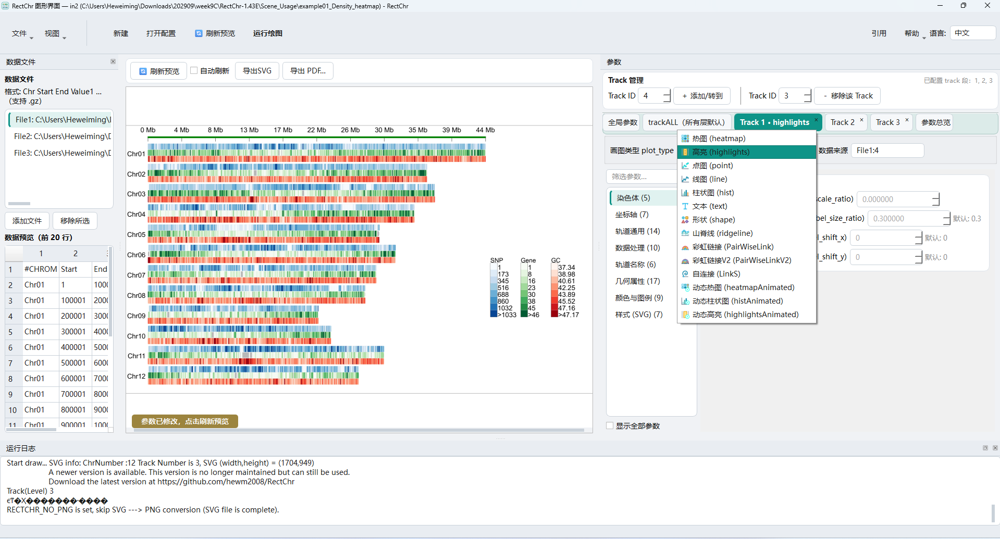

The GUI brings data selection, parameter editing, preview, and export into one workspace:

- **Data panel:** manage input files and preview their first 20 rows.
- **Preview panel:** inspect the SVG plot and refresh it manually or automatically after changes.
- **Parameter panel:** edit grouped settings for chromosomes, axes, tracks, colors, and legends.
- **Run log:** inspect plotting messages and errors.
- **Toolbar:** create or open configurations, refresh previews, run plotting, access help and citation information, and switch between Chinese and English.

The GUI supports data preview, visual parameter configuration, plot-type switching, manual or automatic refresh, and SVG/PDF export. For detailed instructions, see the [Chinese GUI manual](gui/doc/RectChr_GUI_manual_Chinese.pdf) or the [English GUI manual](gui/doc/RectChr_GUI_manual_English.pdf).

## Quick start

### Download

Get the source from [hewm2008/RectChr](https://github.com/hewm2008/RectChr), or download the [v1.50 archive](https://github.com/hewm2008/RectChr/archive/v1.50.tar.gz).

```bash
git clone https://github.com/hewm2008/RectChr.git
cd RectChr
```

Run the following commands from the project root.

### Requirements

| Component | Requirements |
| --- | --- |
| CLI plotting engine | [Perl](https://www.perl.org/); an SVG module is bundled with RectChr |
| GUI from source | Perl, Python 3.9 or later, and PySide6 |
| Optional PNG conversion | ImageMagick's `convert` command |

On Windows, install [Strawberry Perl](https://strawberryperl.com/) and [Python](https://www.python.org/) and ensure both are available on `PATH`.

### Launch the GUI

Linux or macOS:

```bash
sh RectChrGUI.sh
```

Windows: double-click `RectChrGUI.bat` in the project root.

The Linux/macOS launcher attempts to install PySide6 if it is missing; this requires network access and installation permissions. Alternatively, install it in your Python environment and launch the GUI directly:

```bash
python3 -m pip install PySide6
python3 gui/main.py
```

On Windows, use `python` instead of `python3` if that is the installed command.

### Run the CLI

Display help:

```bash
perl bin/RectChr -h
```

Generate a plot from a configuration file:

```bash
perl bin/RectChr -InConf in.conf -OutPut OUT
```

Replace `in.conf` with your configuration file. See [Basic_Tutorials](Basic_Tutorials) for example data and configurations.

| Argument | Description |
| --- | --- |
| `-InConf` | Input configuration file |
| `-OutPut` | Output name supplied to the plotting engine |
| `-h` | Display help |

## Input data

Most tracks use a whitespace-delimited table whose first three columns identify a genomic interval. Additional columns contain numeric statistics or categorical labels:

```text
chr1  1    100  0.25  A
chr1  101  200  0.80  B
chr2  1    100  0.45  A
```

The column structure is `Chr Start End Value1 Value2 ...`. Column numbers in `show_columns` are one-based: `File1:4` selects the fourth column of `File1`, and `File2:4,5` selects the fourth and fifth columns of `File2`. Special plot types may require additional fields; consult their tutorials before preparing input files.

## Configuration

Configuration files have three scopes:

- `SetParaFor = global`: input files and settings for the whole figure.
- `SetParaFor = trackALL`: shared defaults for tracks.
- `SetParaFor = track1`, `track2`, etc.: settings for an individual track.

For the example data above, save the following as `in.conf` and save the data as `input.tsv`:

```ini
SetParaFor = global
File1 = ./input.tsv
track_num = 2
chr_orientation = horizontal
title = "RectChr example"

SetParaFor = trackALL
track_height = 20
background_color = "#B8B8B8"

SetParaFor = track1
plot_type = heatmap
show_columns = File1:4
label = "Statistic"

SetParaFor = track2
plot_type = heatmap
show_columns = File1:5
label = "Category"
```

### Common settings

| Purpose | Parameters |
| --- | --- |
| Chromosome layout | `chr_orientation`, `chr_order`, `chr_spacing_ratio` |
| Regional zoom | `chr_zoom_region`, using `chr:start:end` |
| Track layout | `track_num`, `track_height`, `padding_ratio` |
| Data selection | `File1`, `File2`, `show_columns` |
| Plot type | `plot_type` |
| Color palette | `colormap_brewer_name`, `colormap_reverse`, `colormap_nlevels` |
| Manual color gradient | `colormap_low_color`, `colormap_mid_color`, `colormap_high_color` |
| Value range and capping | `Ymax`, `Ymin`, `cap_max_value`, `cap_min_value` |
| Legends | `colormap_legend_show`, `colormap_legend_shift_x`, `colormap_legend_shift_y` |
| Canvas | `canvas_body`, `canvas_margin_top`, `canvas_margin_bottom`, `canvas_margin_left`, `canvas_margin_right` |

`chr_spacing_ratio` controls spacing between chromosomes; `padding_ratio` controls spacing between tracks within a chromosome. Track-specific settings override shared defaults.

See the [complete parameter reference](NewParaList.xlsx) and the manuals for defaults, accepted values, aliases, and plot-specific options.

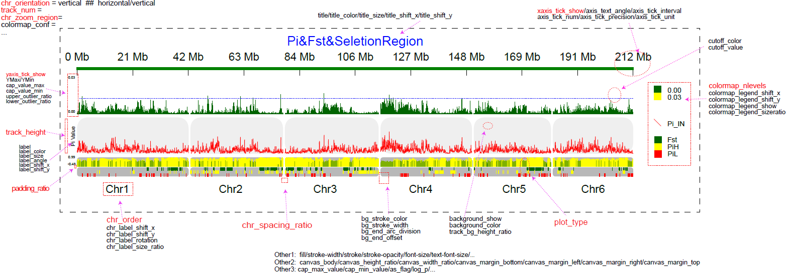

### Output

SVG is the primary plotting output. PNG conversion depends on the available conversion tools; it is not required for SVG generation. The GUI also provides SVG and PDF export.

## Documentation

| Interface | Chinese | English |
| --- | --- | --- |
| GUI | [Chinese GUI manual](gui/doc/RectChr_GUI_manual_Chinese.pdf) | [English GUI manual](gui/doc/RectChr_GUI_manual_English.pdf) |
| CLI | [Chinese CLI manual](doc/RectChr_manual_Chinese.pdf) | [English CLI manual](doc/RectChr_manual_English.pdf) |

- [Parameter reference](doc/NewParaList.xlsx)
- [Basic plotting tutorials](Basic_Tutorials)
- [Application examples](Scene_Usage)

## Examples

### Plot types

Explore individual plot types in [Basic_Tutorials](Basic_Tutorials), then combine them into multi-track figures.

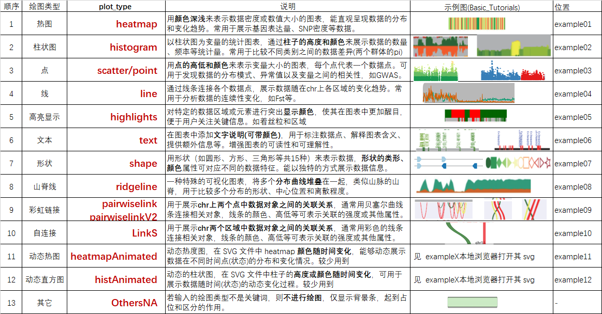

### Application gallery

#### Density heatmaps

[Data and configuration](Scene_Usage/example01_Density_heatmap)

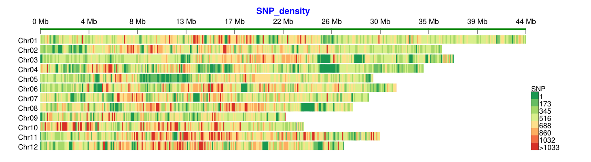

#### Telomere to telomere genomes

[Data and configuration](Scene_Usage/example02_T2T_telo)

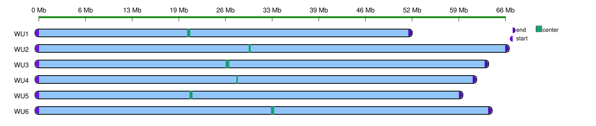
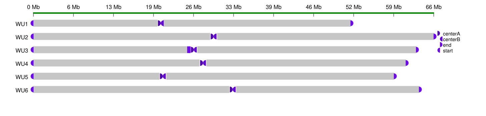

#### Parental markers

[Data and configuration](Scene_Usage/example03_ParentalMaker)

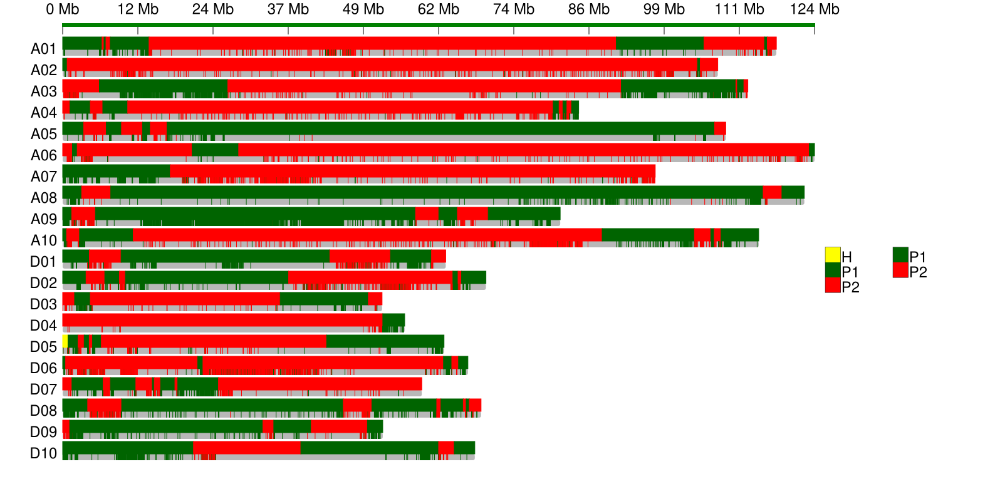

#### RIL bin maps

[Data and configuration](Scene_Usage/example04_RILBinMap)

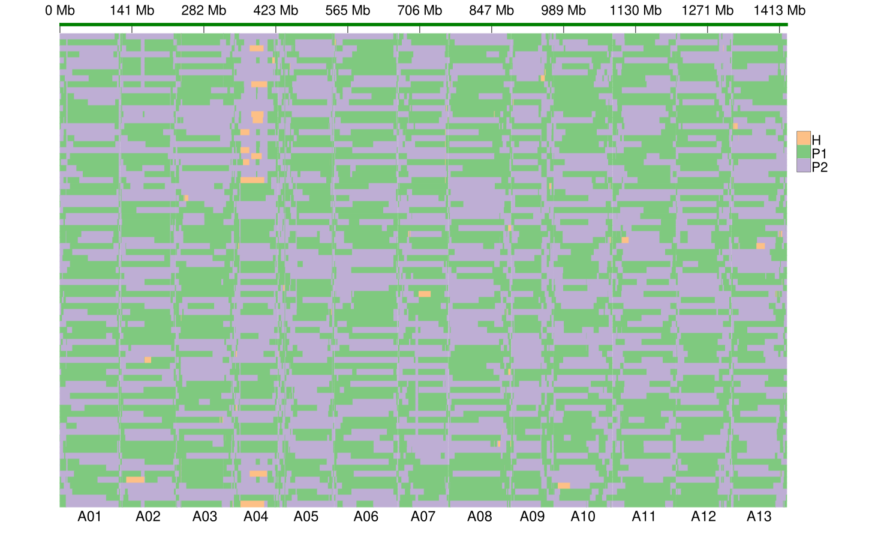

#### Regional haplotypes

[Data and configuration](Scene_Usage/example05_RegionHaplotype)

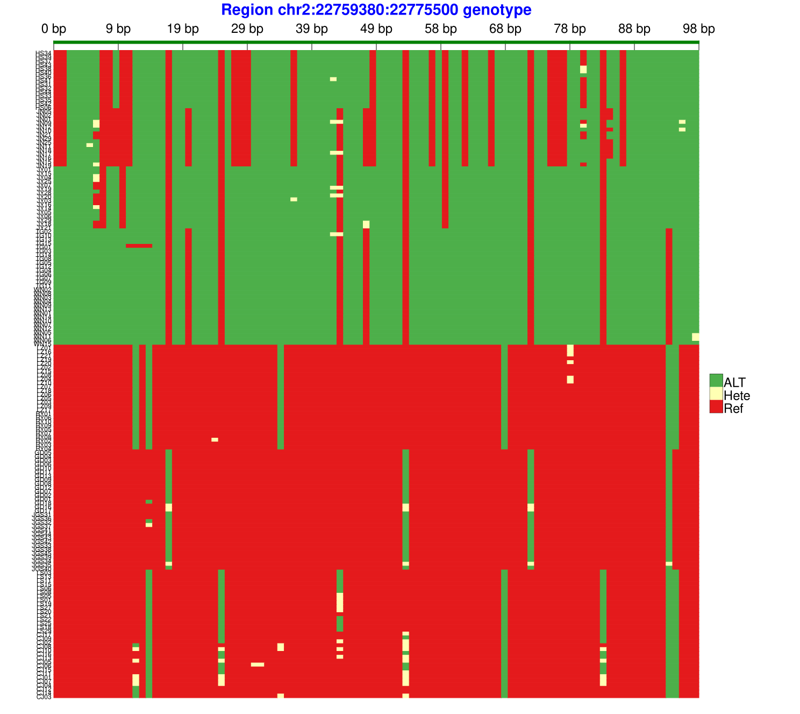

#### Coverage depth

[Data and configuration](Scene_Usage/example06_DepthCov)

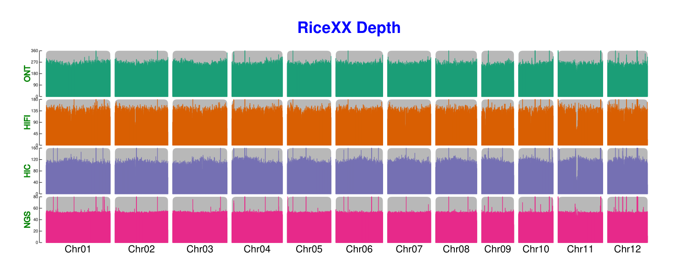

#### Genetic statistics and regional zoom

[Combined statistics](Scene_Usage/example07_Genetics) · [Regional zoom](Scene_Usage/example09_ZoomRegion) · [Peak relationships](Scene_Usage/example10_Peaks)

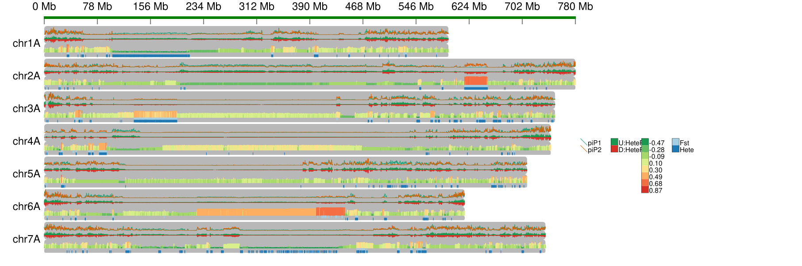
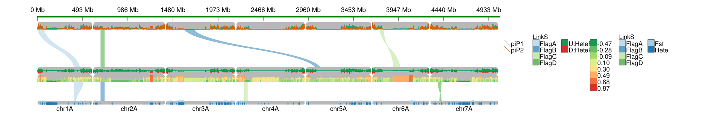
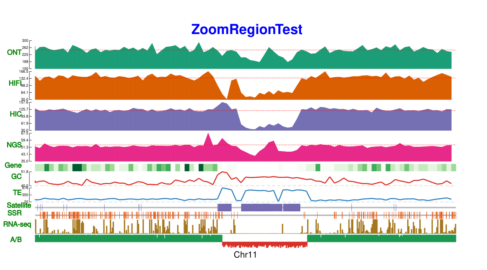
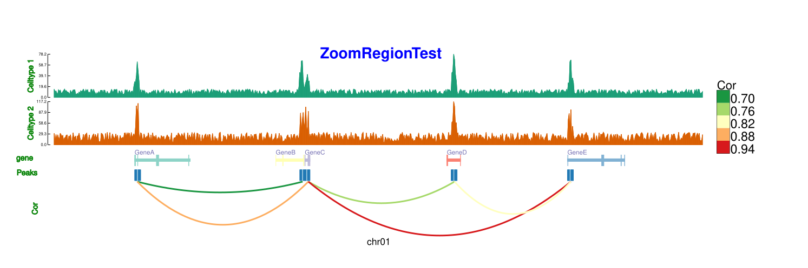

#### Marker labels

[Data and configuration](Basic_Tutorials/example06_sca2chr_text)

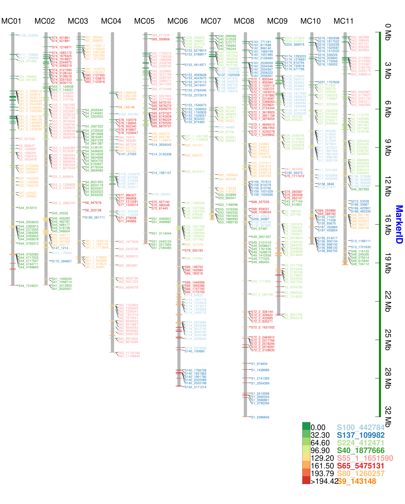

#### GWAS plots

[Data and configuration](Scene_Usage/example08_GWASShape)

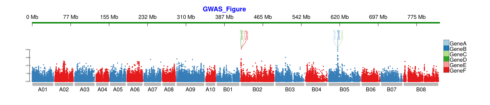
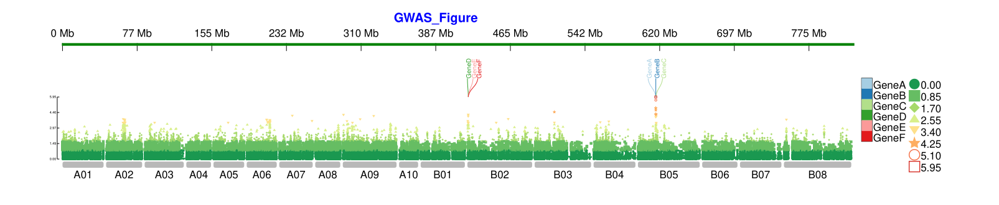

#### QTL regions

[Shape example](Basic_Tutorials/example07_QTL_shape) · [Ridgeline example](Basic_Tutorials/example08_QTL_ridgeline)

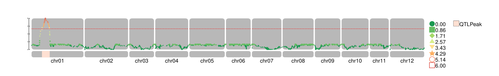
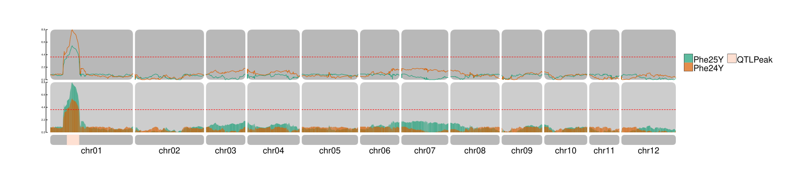

#### Linkage disequilibrium

[Data and configuration](Basic_Tutorials/example09_LDMap_PairWiseLink)

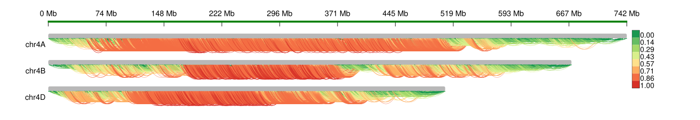

## Published applications

The following figure illustrates applications of RectChr in published research. Search [Google Scholar](https://scholar.google.com/scholar?q=RectChr) for related publications.


## Support

- Report bugs or request features through [GitHub Issues](https://github.com/hewm2008/RectChr/issues).
- Email: [hewm2008@gmail.com](mailto:hewm2008@gmail.com) or [hewm2008@qq.com](mailto:hewm2008@qq.com).
- QQ group: `125293663`.

When reporting a problem, include your operating system, RectChr version, configuration, error log, and a small input dataset that reproduces the issue. Remove private or sensitive data before sharing.

## License

See [LICENSE](LICENSE) for the license terms.
